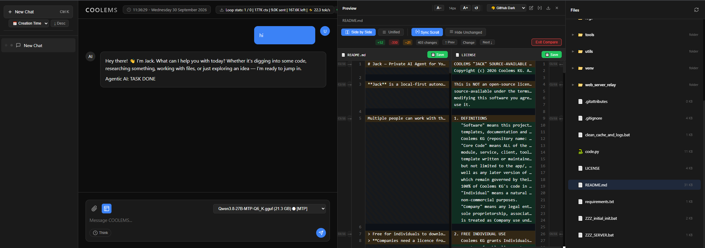

# Jack — Private AI Agent.

<p align="center">
  
</p>

**Jack** is a local-first autonomous AI agent built on the **COOLEMS framework**. It runs entirely on your own hardware: local LLMs (llama.cpp backends) do the thinking, and Jack gives those models hands — file operations, Python execution, browser automation, OCR and image generation — inside a persistent agentic loop. Each Client chat can be set with a specific directory to work with and it will do a local work inside that folder. You can work on a file or on entire repo. Tools are delivered to Client from Server on each request and discarded after use without beeing saved loccaly. 

Multiple people can work with their own agents **at the same time**: every chat runs as an independent background session, so several conversations generate in parallel while switching between them never interrupts anything. The SERVER manages one or more `llama-server` instances on your LAN behind a fair request queue — add another GPU machine and throughput scales with it. By default, no data leaves your local network: the relay only ever talks to the llama servers you configured yourself.

> Free for individuals to download, try and build personal projects.
> **Companies need a licence from Coolems KG.** See [LICENSE](./LICENSE).

---

## Features

- 🤖 **Persistent agentic loop** — Jack plans (plan files), acts with tools, reads results, self-corrects and only stops when the task is verified done
- 💬 **Parallel chats** — every conversation is an independent background session: multiple chats generate at once, switching between them never interrupts another chat; per-chat status dots plus a "N gen · M queued" pill show what is happening in every chat at a glance
- 🖥️ **Multi-server scaling** — one JSON file lists the `llama-server` instances (local or on other LAN machines); each gets its own worker, so N GPUs serve up to N chats simultaneously and the rest wait fairly in FIFO order
- 🔐 **Role-based access control** — per-profile models, tools, rate limits and connection caps, enforced server-side (`config/profiles.json`)
- 📁 **File tools** — read / write / move / rename / delete inside a locked working root
- 🌐 **Browser automation** — drives a real Chrome via CDP: navigation, screenshots, precise mouse targeting, OCR of what's on screen
- 🐍 **Python execution** — sandboxed code runs for calculation and data work
- 🔎 **Web search & fetch** — live internet access with SSRF protection
- 🖼️ **Image generation & vision** — ZImage pipeline + OCR transcription
- ⏰ **Time tools** — local/UTC/city time, timezone differences
- 🔁 **Model auto-switching with drain policy** — running requests finish on their backend; new ones are held back until every instance has reloaded
- 🩹 **LLM self-heal** — a 90 s stream stall kills and restarts the llama-server automatically
- ⚡ **MTP speculative decoding** — auto-detected from the model filename for >2x speedup on MTP builds
- 🔒 **Security by default** — TLS relay, API-key auth, loopback-only client bind (refused without keys), gitignored secrets

## Parallel Chats & Multi-Server Scaling

Two independent mechanisms make Jack usable as a shared team service:

**1. Every chat is its own background session.** The CLIENT's `ChatBus` keeps one channel per conversation — each with its own generation task, stop event and frame buffer. The browser holds one WebSocket per open chat (LRU-capped), so switching to another chat never closes the first one: it keeps generating in the background. While you view chat B, frames arriving for chat A are not rendered but update A's sidebar status dot (`idle` / `queued` / `generating`). The header pill aggregates everything ("2 gen · 1 queued"), and re-attaching to a chat replays its buffered tail so nothing is lost when you switch back.

**2. One queue in front of N llama servers.** Every request from every client lands in the SERVER's bounded FIFO `RequestQueue` (32 pending by default; over-limit requests are rejected with a clear message instead of being dropped). The `WorkerPool` runs exactly one worker per configured backend: each worker pulls the next queued request and executes it on its own llama-server. With one server, chats are served strictly one after another — the classic single-GPU behaviour. With N servers, up to N chats generate simultaneously; the rest wait fairly in FIFO order.

**`config/llama_servers.json` is the single source of truth for backends.** Local entries (`127.0.0.1`) are spawned and managed by the SERVER; remote LAN entries are attach-only — the registry probes their `/health` endpoint every 30 s and uses them while healthy, never spawning anything on those machines. A new GPU box joins the pool with one JSON entry (see Step 8).

## Architecture

```
CLIENT #1 ─┐
CLIENT #2 ─┼── WebSocket (TLS, API-key auth) ──▶ SERVER ── RequestQueue (FIFO, bounded)
CLIENT #n ─┘                                     │        ├── Worker 1 ──▶ llama-server "local"   (spawned by SERVER)
                                                 ▼        ├── Worker 2 ──▶ llama-server "gpu-box-2" (LAN machine, attach-only)
                                   auth + RBAC            └── Worker N ──▶ llama-server "gpu-box-N" (LAN machine, attach-only)
                            (profiles.json: models, tools, rate limits)

Each CLIENT is self-contained: web UI, agentic loop and all tool execution live on the client.
The SERVER never runs tools — it authenticates, applies profiles and relays LLM traffic only.
```

- **SERVER** (`code.py`) — headless relay + control plane. Accepts authenticated WebSocket clients, enforces role profiles (which models/tools each user may use), manages the backend registry, request queue and worker pool, and streams model responses back to the right chat. Two provider modes:
  - `coolems_server` → headless relay only (no UI)
  - `llama` → just relay + launches the CLIENT as a subprocess for local UI use
- **CLIENT** (`CLIENT/code_client.py`) — where all intelligence lives. Can be relocated on another machine and configured to connect to server. It hosts the web UI, the ChatBus background sessions, the agentic loop and every tool execution (files, browser via CDP/Playwright, Python exec, OCR, image generation). All LLM requests are routed through the SERVER; direct LLM access from the client is blocked by design.
- **llama_server** — llama.cpp runtime with pre-downloaded model weights (see `llama_server/download llama_server files.md` for where to get the binaries and how to lay them out). Local instances run on the SERVER machine; remote ones run wherever you put a GPU.

This split keeps secrets and heavy state on one side, makes the relay trivially auditable, lets any laptop on your LAN drive a machine that owns the GPUs, and scales horizontally by editing one JSON file.

## Security Model

| Layer | What it does |
|---|---|
| TLS always on | Relay port 8080 is TLS-only; a self-signed certificate with your LAN IPs as SANs is auto-generated in `config/` on first start if none exists |
| Optional cert pinning | Clients can pin the SERVER's exact SHA-256 certificate fingerprint — trust by fingerprint, no CA infrastructure needed |
| API-key auth | Every WebSocket connection presents its key in the first frame; unknown/inactive keys are rejected with a log entry on the SERVER |
| Role-based access control | `config/profiles.json` decides per user: allowed model folders, allowed tools, Python import restrictions, messages-per-second rate limit, max simultaneous connections — enforced server-side, hot-reloaded |
| Protocol versioning | Every auth frame carries a protocol version; mismatched CLIENT/SERVER builds are detected instead of silently breaking |
| Loopback-only client bind | The CLIENT UI binds to `127.0.0.1` by default; binding `0.0.0.0` is refused at startup unless API keys are configured first |
| Working-root lock | All file tools resolve paths inside one locked folder per machine (per-chat overridable); nothing escapes it |
| Gitignored secrets | Real keys, profiles and server lists live in gitignored files bootstrapped from `.example` templates — a fresh checkout always has the shapes to edit, never real values |
| CORS lockdown | Explicit localhost-only origin list on the CLIENT UI; no wildcards, credentials off |
| SSRF protection | Web search/fetch tools refuse private/internal addresses |
| Tool-source integrity | Tool code delivered from the SERVER is SHA-256 hashed and verified before loading |
| Rate limiting & connection caps | Per-profile messages-per-second limit and per-key max connections, enforced at the relay |

By default, no data leaves your local network: the relay only talks to the llama servers you list in `config/llama_servers.json`, and those are yours — on this machine or elsewhere on your LAN. (`web_server_relay/index.php` is an optional single-file pure-PHP web relay for internet clients — see its header docs; it is not part of the standard LAN deployment.)

## Who Is This For?

- **Companies that can't send prompts to cloud APIs** — legal, medical, financial and R&D teams whose data must stay on their own infrastructure
- **Teams with existing GPU hardware** — put idle or under-used GPU machines to work as a shared internal AI service; each box you add increases how many people can generate at once
- **Dev teams that want code-writing agents on their own stack** — the agent loop, file tools and Python execution run against your models, not a third-party API
- **Organizations needing per-employee access control** — every connection is authenticated, every user gets exactly the models and tools their role allows, with rate limits and connection caps enforced server-side

The reference hardware for Jack is the **base line: 64 GB RAM with an NVIDIA GeForce RTX 5090 (32 GB VRAM)** GPU. The installer's default model recommendations and context-window sizing are tuned to this machine; weaker GPUs still work — `ZZZ_initial_init.bat` detects your card and picks a Qwen3.8-27B quant that fits its actual VRAM, and any laptop can run the CLIENT (even without GPU). Choosing to not load vision module will give enough space to work with up to 200K context window on 32GB VRAM.

## Repository layout

```
├── code.py                 # SERVER entry point (auth + queue + relay)
├── ZZZ_SERVER.bat          # Windows launcher: auto-creates venv, installs deps, starts SERVER
├── requirements.txt        # All Python dependencies (server + client)
├── config/                 # SERVER configuration (+ .example templates, bootstrapped at startup)
│   ├── .api_keys.json      #    ← your API keys  (gitignored; seeded from .api_keys.example.json)
│   ├── profiles.json       #    ← role profiles  (gitignored; seeded from profiles.example.json)
│   └── llama_servers.json  #    ← LLM backends: local + LAN instances (gitignored; seeded from .example)
├── app/                    # Shared server-side modules
│   ├── providers/          #     llama backend registry, queue integration, auth gateway plumbing
│   ├── server_queue/       #     RequestQueue (bounded FIFO) + WorkerPool (one worker per backend)
│   └── auth_gateway/       #     key/profile validation and enforcement
├── CLIENT/
│   ├── code_client.py      # CLIENT entry point (UI + agent + tools)
│   ├── index.html          # Web UI
│   ├── app/chat_bus/       # Per-chat background sessions (parallel generation)
│   └── config/             # Per-machine client settings (gitignored; seeded from .example files)
│       ├── .api_client_keys.json  # ← bookkeeping ONLY (email + date) - the real key is never stored here
│       ├── settings.json          # ← which SERVER address(es) to connect to
│       └── .working_root.json     # ← folder all file tools are locked into
├── utils/                  # Helper scripts (zzz_init.py, gen_ui_certs.py) + ScreenShot.png
    ├── llama_server/           # Local LLM runtime binaries + models (binaries are NOT in git)
├── web_server_relay/       # Optional single-file pure-PHP internet relay (index.php; not part of the standard LAN deployment)
└── tests/                  # Test suite
```

---

## Installation & Setup Guide

Follow the steps **in order**. After step 6 you have a fully working UI ↔ CLIENT ↔ SERVER ↔ local LLM chain.

> ### TL;DR — quick start (Windows, ~5 minutes)
>
> The whole guide below is detail. For a fresh clone on Windows you only need:
>
> 1. **Download the repo** and double-click **`ZZZ_initial_init.bat`** at the root — it sets everything up in one go (checks Python, picks & downloads a model that fits your GPU, installs llama.cpp, generates the API key into both configs). **Do not close this window until you have added the API key in the UI (step 5 below).**
> 2. Double-click **`ZZZ_SERVER.bat`** at the root — **leave it running**.
> 3. In the `CLIENT/` folder, double-click **`ZZZ_CLIENT.bat`** — leave it running too.
> 4. Open a browser and go to **https://127.0.0.1:8000/** (the "Not secure" warning is expected — self-signed local certificate).
> 5. In the UI: **gear icon → Settings → Authentication** → paste the API key from the `ZZZ_initial_init.bat` window, enter your e-mail and click **Connect**. Done — start chatting.
> 6. *(Optional)* Point Jack at any repo you like: in the header there is a **Working Folder** — click it and type/paste any directory path to change the working root for all file operations. It starts out as the folder where the code was launched; you can change it at any time from the UI. All tools are restricred to operate only inside working root.

### Fastest path: `ZZZ_initial_init.bat` (recommended for a fresh clone)

On Windows, just **double-click `ZZZ_initial_init.bat`** at the repo root. It checks that you have
Python 3.10+ (and tells you where to get it if not), then runs `utils/zzz_init.py`, which in one go:

- detects your NVIDIA GPU and recommends a Qwen3.8-27B quant that fits its VRAM (you can override);
- downloads the model from HuggingFace (resumable, size-verified) into `llama_server/models/<quant>/`;
- optionally adds the **MTP** draft file for >2x speedup (the main file is renamed so "MTP" is in its
  name - that's what auto-enables speculative decoding);
- optionally downloads the GLM-OCR model (enables `transcribe_image`);
- installs the pinned llama.cpp build **b10441** (or waits while you drop a newer one in by hand);
- generates an API key and writes it into **both** the SERVER and CLIENT config files, rewires all
  profile model/OCR paths to this machine, pre-seeds the startup model, and sets the context window
  to a value your GPU can hold.

Then run `ZZZ_SERVER.bat` (and `CLIENT\ZZZ_CLIENT.bat`) - first runs self-create their venvs. The
manual steps below describe what that script does, for reference / non-Windows machines.


### Step 1 — Install prerequisites & get the model binaries

1. Clone the repo and install Python 3.10+.
2. Get the `llama_server` binaries — follow **`llama_server/download llama_server files.md`** (~1.3 GB of llama.cpp Windows CUDA release; not shipped in git).
3. Put your model weights into **one folder per model** under `llama_server/models/`, e.g.:

   ```
   llama_server/models/qwen38-q6/Qwen3.8-27B-UD-MTP-Q6_K.gguf
   ```

   The *folder* is the model identity — profiles in step 3 reference these folders by absolute path. (Optional: a separate OCR model folder, e.g. `llama_server/models/glm_ocr/`, enables the `transcribe_image` tool.)

   **Any GGUF works.** Drop any `.gguf` file you want to try into its own new folder under `llama_server/models/` — no code changes needed. Point a profile's `allowed_models_folders` at that folder (or use an admin profile) and the model shows up in the UI selector; switch to it from there, or let `ZZZ_initial_init.bat`'s pre-seeded startup pick it.

### Step 2 — Create your API keys (SERVER side)

Open **`config/.api_keys.json`** in the repo root. On first start it is created automatically from the shipped `.api_keys.example.json` template, so a fresh checkout always has the file to edit. It contains one placeholder entry:

```json
[
  {
    "key": "PASTE_YOUR_API_KEY_HERE",
    "email": "your-email@example.com",
    "role": "admin",
    "date_acquired": null,
    "is_active": true,
    "max_connections": 10,
    "last_used": null
  }
]
```

Replace the placeholder with your real entry:

| Field | What to put |
|---|---|
| `key` | Any unique string. Generate one with: `python -c "import secrets; print(secrets.token_hex(32))"` (64 hex chars) |
| `email` | The e-mail you'll use in the HTML UI (step 6) — it is recorded with your key and returned by the SERVER at handshake, so keep both identical |
| `role` | The profile name this user gets — must exist in `config/profiles.json` (step 3). No matching profile = connection rejected |
| `is_active` | `true` to allow login; set `false` to disable a key without deleting it |

Add more entries to the array for more users. The file is **gitignored** — never commit real keys.

### Step 3 — Make profiles (SERVER side)

Profiles live in **`config/profiles.json`**: one JSON object per role name. The `role` field of every key in `.api_keys.json` picks its profile; the SERVER enforces everything from it (models, tools, rate limits). A fresh checkout is seeded with two examples — `admin` and `user`:

```json
{
  "coder": {
    "description": "Coding specialist - code tools and file operations only",
    "allowed_models_folders": [
      "C:\\models\\qwen38-q6"
    ],
    "ocr_model": "C:\\models\\glm_ocr",
    "allowed_tools": [
      "read_file", "write_file", "list_files", "delete_file", "rename_file",
      "move_file", "python_exec", "git_clone", "web_search", "fetch_url"
    ],
    "python_exec_blocked_libs": "blocked_libs_set01.json",
    "max_rate_limit": 90,
    "max_connections": 2
  }
}
```


| Field | Meaning |
|---|---|
| `description` | Free text — shown to humans only |
| `allowed_models_folders` | List of **absolute paths to model folders** (step 1). Each folder = exactly one model, matched by exact folder name. A folder that doesn't exist on disk is dropped; if none resolve the profile gets no models. Use this list to give a user access to only some of your models |
| `ocr_model` | Absolute path to an OCR model folder (enables `transcribe_image`) or `null` |
| `allowed_tools` | `null` = **all tools allowed**, or an explicit list of tool names. Anything not listed is invisible to that user |
| `python_exec_blocked_libs` | Name of a blocked-libs set file inside `config/`: `blocked_libs_admin.json` (empty = no restrictions) or `blocked_libs_set01.json` (restricted imports). The SERVER ships the right set to each CLIENT automatically |
| `max_rate_limit` | Messages per second for this profile |
| `max_connections` | Simultaneous WebSocket connections allowed per key of this role |

**To create a new profile:** add a new object with its own name (e.g. `"coder"` above), then give people access by adding `.api_keys.json` entries with `"role": "coder"`.

> ⏱️ **No restart needed.** The SERVER re-reads both `config/.api_keys.json` and `config/profiles.json` automatically — changes apply within ~60 seconds (or immediately after the file's modification time changes). Only a *new* model folder may need a fresh UI page load to appear in the model selector.

### Step 4 — Start the SERVER (relay only)

The SERVER is headless — no UI, no tools. It authenticates clients and relays them to the LLM backends listed in `config/llama_servers.json`.

**Windows:** double-click **`ZZZ_SERVER.bat`** from the repo root (or run it from a terminal):

```bat
ZZZ_SERVER.bat                         # headless relay → listens for clients on port 8080 (TLS)
```

The launcher auto-creates `venv/`, installs `requirements.txt` and starts `code.py`. The SERVER then:

1. Bootstraps any missing config files from their `.example` templates (step 2/3 files, if you deleted them).
2. Starts or attaches every llama backend in `config/llama_servers.json` — local instances (`127.0.0.1`) are spawned on port **5000** by default (dedicated OCR instance on **5010** when used); remote LAN entries are health-probed only. A startup table logs the state of every backend.
3. Listens for clients on the WebSocket relay port — default **8080**, TLS always on; a self-signed certificate is auto-generated in `config/` on first start if none exists.

| Port | What | Notes |
|---|---|---|
| 8080 | WebSocket relay, TLS on | the address clients connect to (`IP:8080`) |
| 5000 / 5010 | llama-server / OCR instance (local) | internal, auto-managed by the SERVER; remote backends use whatever ports you configured for them |

**Manual (any OS):**

```bash
python -m venv venv && source venv/bin/activate        # Windows: venv\Scripts\activate
pip install -r requirements.txt
python code.py                                         # headless relay (default provider=coolems_server)
```

> The SERVER keeps running until you stop it (Ctrl+C or close the console). Leave that window open — step 5 runs in its own terminal.

### Step 5 — Start the CLIENT and open the browser UI

The CLIENT is where all intelligence lives: web UI, ChatBus background sessions, agentic loop and tools. It serves an HTML page on **https://127.0.0.1:8000/** (TLS, loopback-only — plain HTTP only if no certificates are present at all) and connects to the SERVER from step 4 over WebSocket (UI → CLIENT → SERVER → LLM).

**Windows:** open a *second* console at the repo root and run **`CLIENT\ZZZ_CLIENT.bat`** (or just double-click that file in Explorer):

```bat
cd CLIENT
ZZZ_CLIENT.bat                         # auto-creates CLIENT/venv, installs deps + Chromium, frees port 8000, starts code_client.py
```

**Manual (any OS):**

```bash
cd CLIENT
python -m venv venv && source venv/bin/activate        # Windows: venv\Scripts\activate
pip install -r requirements.txt
playwright install chromium                            # for browser tools
python code_client.py --port 8000                      # serves the HTML UI on https://127.0.0.1:8000/ when certs exist, else HTTP (loopback-only)
```

Then **open a browser** and go to **https://127.0.0.1:8000/** — this connects your browser to the CLIENT's HTML server on port 8000; from that page every request flows through the SERVER relay you started in step 4.

> 🔒 **Browser says "Not secure"? That is expected and safe.** The UI speaks HTTPS with a self-signed certificate, so browsers flag it as untrusted — nothing to worry about: the address is `127.0.0.1` only (loopback) and no data ever leaves your machine. To get the proper padlock instead of the warning, install the local CA once: run `python utils/gen_ui_certs.py CLIENT/certs` (creates `ca.crt`, `server.crt`, `server.key`) and import `CLIENT/certs/ca.crt` into your browser or OS trust store — step-by-step instructions in [`certs/_readme_how_to_install_cerificates.txt`](./certs/_readme_how_to_install_cerificates.txt). (`ZZZ_initial_init.bat` does all of this automatically on a fresh clone.)

| Port | What | Notes |
|---|---|---|
| 8000 | CLIENT web UI (HTTP/HTTPS) | loopback-only unless `COOLEMS_CLIENT_HOST=0.0.0.0` **and** keys are configured — otherwise startup refuses |

> 💡 **One-command shortcut:** on the same machine, `ZZZ_SERVER.bat provider=llama` (or `python code.py provider=llama`) starts the relay *and* auto-launches this CLIENT subprocess for you — handy for quick local use. The separate flow above is what you do when running a client on another machine or managing it yourself.

### Step 6 — Set the e-mail and API key in the HTML UI

This is what makes the UI actually work with your CLIENT process and SERVER. Do it **once per browser**.

1. Open **https://127.0.0.1:8000/** (plain `http://` only in the certificate-less standalone mode — see the note in step 5).
2. Click the **gear icon** (top right) → **Settings** → **Authentication** tab.
3. On a fresh machine you're in **SETUP MODE**: everything is hidden except the *API Key* field and the **Set API Key** button — by design, nothing else works until a key exists. The CLIENT starts its UI **immediately** (no waiting for the SERVER) and Settings shows live boot status: *Waiting for your API key...* while you're still in setup mode, then "Connecting to SERVER... (attempt N, ~Xs budget left)" once the key is set — no restart needed.
4. Paste the API key you created in step 2 into **API Key** and click **Set API Key**. This:
   - stores the key in your browser (localStorage) — it is NEVER written to disk on this machine, and
   - records `{email, date_acquired}` in `CLIENT/config/.api_client_keys.json` via `POST /api/auth/set-key` (bookkeeping only).

   The real key exists in three places: your browser UI (localStorage), the CLIENT config file `CLIENT/config/.api_client_keys.json` (plaintext single row — written by this dialog and by the init script; no registry writes, works on Windows/macOS/Linux) and the SERVER's `config/.api_keys.json`. Headless CLIENT startup (before any browser is open) authenticates with the key from that config file. An optional `COOLEMS_CLIENT_API_KEY` environment variable acts as a fallback for headless/CI use — the config file takes precedence over it.

   The rest of the Settings UI unlocks immediately — no restart needed.
5. In **Email Address**, enter the e-mail from step 2 — use the same one you recorded next to your key in `config/.api_keys.json`, since that's how the SERVER identifies you (it returns the registered e-mail on a successful handshake). The e-mail is mandatory for every request; without it nothing works. (What actually gates access is the API key — but keep both consistent so logs and status match.)
6. Click **Connect**. A green **"Connected successfully."** means the full chain validated: UI → CLIENT → SERVER WebSocket auth → profile applied. The connection status dot in the header switches from *Disconnected* to connected, and the model selector now lists exactly the models your profile allows.

> 🔁 Where things are stored: the real key lives in your browser localStorage (`coolems_api_key`), in `CLIENT/config/.api_client_keys.json` (exactly **ONE** row `{email, date_acquired, key}` at a time — every re-set replaces all previous rows, single-key contract; plaintext by design since 2026-10-08, no registry writes) and on the SERVER (`config/.api_keys.json`). The optional `COOLEMS_CLIENT_API_KEY` env var is only a fallback (the config file wins). A second machine or a second browser repeats step 6 with its own copy of the key. **Clear Key** in Settings removes the local key and drops you back into setup mode.

### Step 7 — Connect a remote CLIENT (optional): server on a powerful workstation, client on any laptop

**The entire `CLIENT/` folder is self-contained — no installation step.** You can copy it to any other machine on your LAN and run it there as-is. The typical setup: SERVER + llama_server on a **powerful GPU workstation**, CLIENT on **any laptop**. The laptop needs no GPU, no VRAM and no model files — every LLM request flows through the relay to the workstation's local model; the laptop only runs the UI, the agent loop and the tools.

1. On the **workstation** (SERVER side): start headless with `ZZZ_SERVER.bat` and allow **TCP port 8080** in its firewall.
2. On the **laptop**: copy the entire `CLIENT/` folder from the repo (USB stick, network share, or just clone the whole repo — either works). Before copying you may delete `venv/`, `logs/` and optionally `chat_history.db` — the launcher recreates a fresh local venv on first run and re-creates everything else it needs. Then run **`CLIENT\ZZZ_CLIENT.bat`**: it auto-creates `CLIENT/venv`, installs deps + Chromium, frees port 8000 and starts `code_client.py`.
3. In the UI: **Settings → Authentication → Server Address**. Type the workstation's address as `IP:port` — e.g. `192.168.1.50:8080` — and press Enter/blur to save. The value is written to `CLIENT/config/settings.json` (the single source of truth; you can also edit that file directly). **Restart the CLIENT process** for a changed address to take effect. Leave it empty / click **Reset** to auto-detect this machine's LAN IP on next start.
4. Point the working root at a local folder: if you copied an existing `CLIENT/config/.working_root.json`, it still points at the workstation's path — change it via the **folder chip in the UI header**, or edit that file (all file tools are locked into this folder, per machine).
5. Set API key + e-mail as in step 6 → **Connect**. The laptop now drives Jack on the workstation: models listed are exactly what your profile allows, and all heavy lifting happens where the GPU is.

### Step 8 — Scale out: add a second GPU machine (optional)

The SERVER serves every chat through its request queue; adding another llama-server adds one more worker to that pool.

1. On the **second GPU machine**: run a `llama-server` instance with the same model weights (e.g. this repo's `llama_server/` layout, or your own llama.cpp deployment) on a fixed port — say `5000`.
2. On the **SERVER machine**, edit **`config/llama_servers.json`** and add an entry:

   ```json
   [
     { "name": "local",    "host": "127.0.0.1", "port": 5000 },
     { "name": "gpu-box-2","host": "192.168.1.60", "port": 5000 }
   ]
   ```

3. **Restart the SERVER.** At boot it logs a table of every backend: local entries are spawned, remote ones are attach-only — probed and used while healthy, never spawned or managed remotely. From then on two chats can generate at once; a third waits in the queue until a worker frees up (the UI shows it as *queued*).

Notes:
- All backends are expected to run **the same model**. When you switch models from the UI, every local instance reloads sequentially and remotes are verified afterwards — a remote still running a different model is marked unhealthy until you update it by hand.
- The queue is bounded (32 pending requests across all chats); over-limit requests get a clear "queue full" message instead of being dropped silently.
- Invalid entries in `llama_servers.json` (missing host, bad port) are skipped with a logged warning; duplicate `host:port` pairs dedupe to the first occurrence.

## Troubleshooting

| Symptom | Fix |
|---|---|
| Banner *"No API key set yet - open Settings and set your API key"* | You're in setup mode — the UI starts immediately anyway; Settings shows live boot status. Do step 6 first; nothing else is reachable until then (by design) |
| SERVER log shows *sent empty API key -- rejecting* on every client retry | The CLIENT has no key yet (fresh machine, no key in `CLIENT/config/.api_client_keys.json`): open the CLIENT UI → Settings and set the key. The next bootstrap attempt authenticates automatically; the SERVER rejection is correct behavior |
| Connect says *Your data can't be validated* / 401 | The key isn't found or inactive on the SERVER: check `config/.api_keys.json` for an exact match and `"is_active": true`; check `logs/coolems.log` on the SERVER for the rejection reason |
| *"Authentication failed or no valid profile"* | The key's `role` has no matching entry in `config/profiles.json` — add the profile (step 3) or fix the role name; both files hot-reload, just retry Connect |
| Model selector empty / model missing | The folder path in `allowed_models_folders` doesn't exist on disk (exact folder = exact model). Fix the absolute path in `profiles.json`; wait for reload and refresh the UI |
| CLIENT can't reach SERVER at all | Wrong address or firewall: verify the Server Address field (shows *Active* vs *Saved*), confirm port 8080 is open, and remember a changed address needs a CLIENT restart. `CLIENT/config/settings.json` is authoritative |
| A remote backend shows UNAVAILABLE in the boot table | The llama-server on that machine isn't running or its firewall blocks the health probe; fix it there — the SERVER only attaches, never starts remote instances |
| Chat sits at *queued* for a long time | All backends are busy: more chats were started than you have GPUs. It will start when a worker frees up (FIFO), or add another backend (step 8) |
| *"Refusing to bind 0.0.0.0 with no API keys configured"* | You set `COOLEMS_CLIENT_HOST=0.0.0.0` before any key exists — do step 6 first, or unset the variable (loopback default) |
| First start is slow / UI says *Loading models...* | The SERVER waits for llama-server to load the model into VRAM; the CLIENT keeps retrying for up to 30 min by default (`BOOTSTRAP_MAX_WAIT_SEC`). Watch `logs/coolems.log` |

---

## Configuration (summary)

- **SERVER** config lives in `config/` — real values (API keys, profiles, backend list, per-machine state) are **gitignored**; only `.example` templates are tracked and used to bootstrap first runs. See steps 2–3 above for the exact file shapes.
  - **`llama_servers.json`** — one entry per llama-server instance: `name`, `host`, `port`. Hosts of `127.0.0.1`/`localhost` are spawned and managed by the SERVER; any other host is a remote LAN machine, attached to (health-probed every 30 s) but never controlled. This file decides how many chats can generate simultaneously.
- **CLIENT** config lives in `CLIENT/config/` — same pattern: gitignored data files bootstrapped from `.example` templates (`.api_client_keys.json`, `settings.json`, `.working_root.json`). The working root is locked: all file tools resolve paths inside it; nothing escapes. You can change it live via the folder chip in the UI header or by editing `.working_root.json`.
- Bind the CLIENT UI beyond loopback only with `COOLEMS_CLIENT_HOST=0.0.0.0` **and** API keys configured — otherwise startup refuses.

## License

This project is **source-available, not open source**.

| Use | Terms |
|---|---|
| Individual / personal use (download, run, modify, private personal projects) | **Free**, no fee, see [LICENSE](./LICENSE) |
| Company / commercial use (any legal entity, products, services for third parties) | **Requires a written licence from Coolems KG** |

Full text: [`LICENSE`](./LICENSE). For company licences, contact **Coolems KG**.
